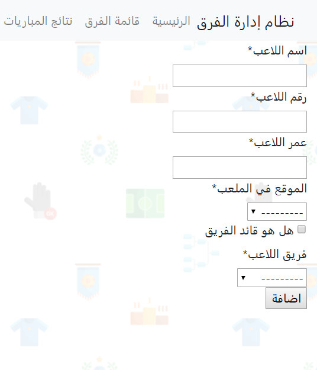
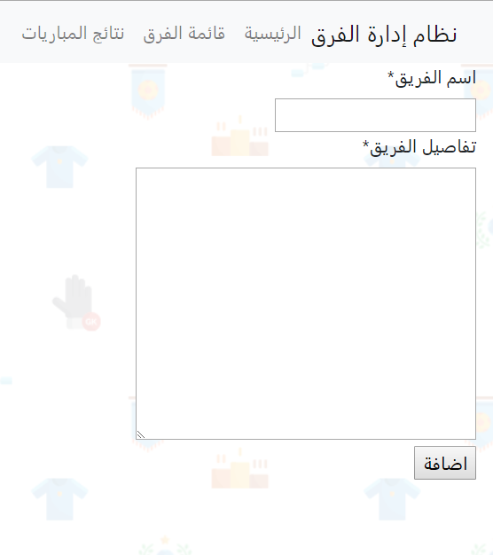
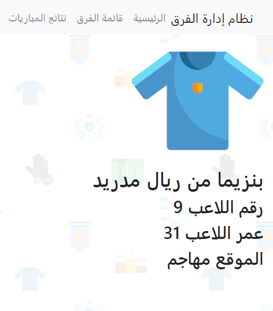
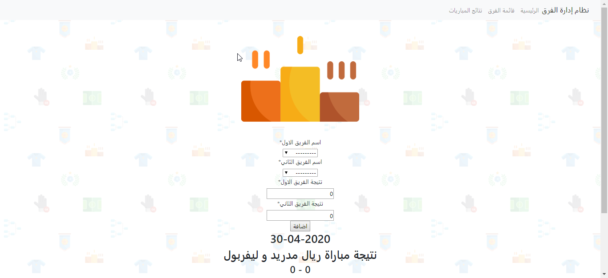

# teammanager
This is the first project from [Web Development with Django](https://app.barmej.com/%D8%A8%D8%B1%D9%85%D8%AC%D8%A9-%D8%A7%D9%84%D9%85%D9%88%D8%A7%D9%82%D8%B9-%D9%85%D8%B9-%D8%AC%D8%A7%D9%86%D8%BA%D9%88-Django) course, it is basically a football teams management system <br><br>


## Features
- Add a new team
- Add a new player
- Add a game score between two teams
- Show players & teams details
- Show games scores
- **(TDD tests for)** Team creation & (team details/list) views & URL's

## Screenshots
<h4 align="center">welcome page</h4>
<p align="center"></p>
<table>
    <tr>
      <th>add player</th>
      <th>add team</th>
    </tr>
    <tr>
      <td width="400px"></td>
      <td></td>
    </tr>
    <tr>
      <th>player details</th>
      <th>team details</th>
    </tr>
    <tr>
      <td></td>
      <td></td>
    </tr>
    <tr>
      <th>games scores</th>
      <th>teams list</th>
    </tr>
    <tr>
      <td></td>
      <td></td>
    </tr>
</table>

## Tools & Languages
- HTML5
- CSS3
- Bootstrap4.4
- [Cripy forms](https://django-crispy-forms.readthedocs.io/en/latest/install.html)
- Django
- VSCode

## Usage

```bash
// 1- Create a virtual environment
~ virtualenv teammanager_env
// 2- Activate the virtual environment
(Mac)
~  source teammanager_env/bin/activate
(Windows)
~  cd teammanager_env/Scripts
~  activate
~  cd ../..
// 3- Change directory to the project folder
~ cd teammanager
// 4- Install dependecies from requirements.txt file
~ pip install -r requirements.txt
// 5- Check if all dependencies were installed successfully
~ pip freeze
// 6- Open teammanager folder with pycharm & select virtual environment python interpreter
// 7- Run server
~ python manage.py runserver
```
### Other usefull commands
You may also consider running these commands (if needed)
```
// Run all tests
~ python manage.py test
// Create a super user
~ python manage.py createsuperuser
// Make & apply migrations
~ python manage.py makemigrations
~ python manage.py migrate
// Open shell
~ python manage.py shell
```

## Contributing
Pull request are welcome feel free to ```fork``` this repo.

## License
This project is open-sourced under the [MIT](https://opensource.org/licenses/MIT) license.
